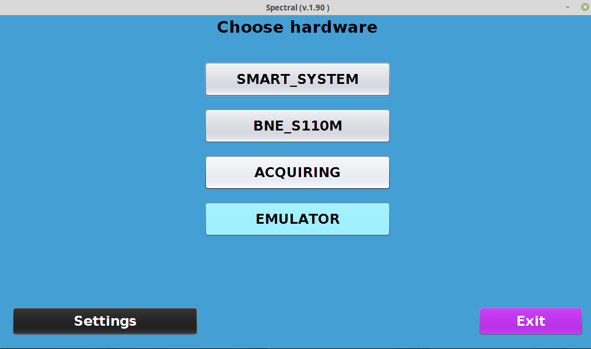

# README #

Репозиторий **Spectral** включает в себя графическую реализацию протоколов:
* SmartPayout и SmartHopper на базе CC2, он же cctalk
* BNE-S110M 
* UCS POST-TERMINAL эквайринг

а также такие эмуляторы устройств, как:
* Монетоприемник cctalk (emp800)
* Купюроприемник ccnet (cashcode) с режимом моста (bridge mode)

Также реализован эмулятор ccnet, взаимодействующий с сервером платежей для командной строки - без использования 
графического интерфейса. Хорошо работает на железе с ограниченными ресурсами. 

